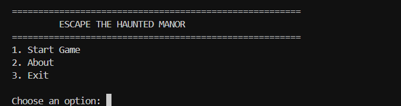
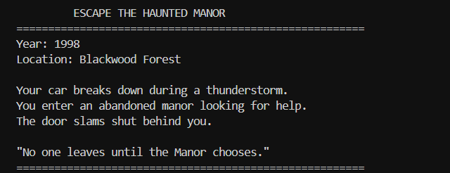
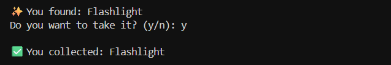
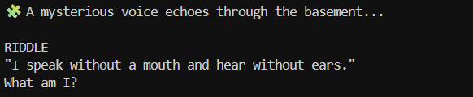
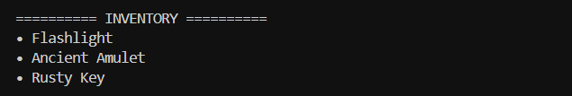
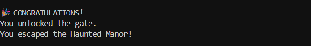

# 🏚️ Escape The Haunted Manor

A text-based adventure game developed in Python where the player explores a haunted mansion, collects important items, solves a puzzle, and attempts to escape before it's too late.

---

## 📖 Story

A violent thunderstorm leaves you stranded in the mysterious Blackwood Forest. Seeking shelter, you enter an abandoned manor. Moments later, the massive entrance door slams shut behind you.

To escape, you must explore different rooms, collect important items, solve an ancient riddle, and unlock the final gate.

---

## 🎮 Features

- Interactive text-based gameplay
- Multiple connected rooms
- Inventory system
- Item collection
- Score tracking
- Basement puzzle (riddle)
- Multiple endings (Good & Bad)
- Simple command-line interface

---

## 🛠️ Technologies Used

- Python 3
- Object-Oriented Programming (OOP)
- Git
- GitHub
- Visual Studio Code

---

## 📂 Project Structure

```
EscapeTheHauntedManor/
│
├── assets/
├── saves/
├── screenshots/
│   ├── main_menu.png
│   ├── introduction.png
│   ├── item_collection.png
│   ├── puzzle.png
│   ├── inventory.png
│   └── good_ending.png
│
├── game.py
├── player.py
├── rooms.py
├── main.py
├── inventory.py
├── items.py
├── enemies.py
├── utils.py
├── requirements.txt
└── README.md
```

---

## ▶️ How to Run

Clone the repository:

```bash
git clone <repository-url>
```

Move into the project directory:

```bash
cd EscapeTheHauntedManor
```

Run the game:

```bash
python main.py
```

---

## 🎯 Gameplay

1. Start the game.
2. Enter your player name.
3. Explore the manor.
4. Collect:
   - 🔦 Flashlight
   - 🗝️ Rusty Key
   - 📿 Ancient Amulet
5. Solve the Basement riddle.
6. Reach the Exit Gate.
7. Escape the Haunted Manor.

---

## 📸 Screenshots

### Main Menu



### Introduction



### Item Collection



### Puzzle



### Inventory



### Good Ending



## 📚 Concepts Used

- Classes & Objects
- Functions
- Loops
- Conditional Statements
- Dictionaries
- Lists
- User Input Handling

---

## 👨‍💻 Author

**Prakhar Rastogi**

B.Tech Computer Science Engineering  
Manipal University Jaipur

---

## 📄 License

This project was created for educational and internship purposes.